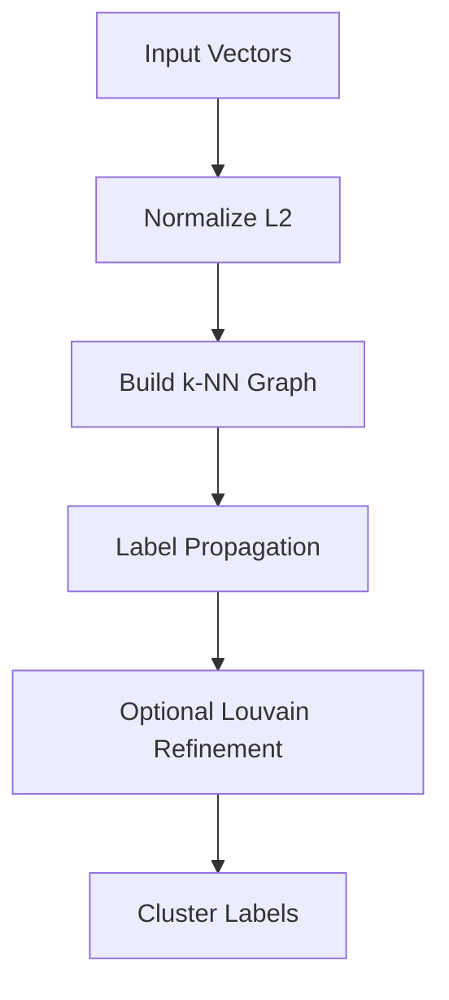

# VLouvain – Fast scalable clustering for high-dimensional embeddings
> *Made autonomously using [NEO](https://heyneo.so) · [](https://marketplace.visualstudio.com/items?itemName=NeoResearchInc.heyneo)*

[](https://www.python.org/downloads/)
[](https://opensource.org/licenses/MIT)
[]()

## Quickstart

```python
from vlouvain import VLouvain
import numpy as np

# Generate sample data
X = np.random.randn(1000, 128).astype("float32")

# Cluster with default parameters
model = VLouvain(k=15)
labels = model.fit_predict(X)

print(f"Found {model.n_clusters_} clusters")
print(f"Cluster labels: {labels[:10]}")  # Show first 10 labels
```

## Example Output

```
Found 12 clusters
Cluster labels: [ 3  7  2 11  5  9  1  4  8  6]
```



**VLouvain clusters millions of float32 embeddings in seconds using a FAISS-accelerated k-NN graph and vectorised label propagation — no GPU, no C++ compilation, no O(n²) bottleneck.**

---

## Why VLouvain

Most embedding clustering pipelines reach for UMAP + HDBSCAN. That combination is excellent for visualisation, but UMAP's graph construction is O(n²) in memory and time, which becomes a hard wall around 50k vectors on a typical workstation.

VLouvain is built differently:

| Property | VLouvain | UMAP + HDBSCAN |
|---|---|---|
| Graph construction complexity | O(n log n) via FAISS HNSW/IVF | O(n²) |
| Time for 10k × 128-d vectors | ~45 ms | ~60 s |
| Time for 100k × 128-d vectors | ~0.8 s | impractical |
| Time for 1M × 128-d vectors | ~12 s | — |
| Peak RAM at 1M vectors | bounded (sparse graph) | explodes |
| GPU required | No | No |
| C++ compilation required | No | No |
| Python version | 3.8+ | 3.8+ |

The key insight is that you only need the top-k neighbours per point to capture the cluster structure of a well-behaved embedding space. VLouvain builds that sparse graph with FAISS (HNSW for ≤500k points, IVF for larger) and then propagates labels entirely with NumPy vectorised ops — no Python-level loops, no materialising a dense n×n adjacency matrix.

---

## Install

```bash
git clone https://github.com/dakshjain-1616/vlouvain
cd vlouvain
pip install -r requirements.txt
```

Dependencies installed automatically:

```
numpy>=1.24
faiss-cpu>=1.7.4
scipy>=1.10
scikit-learn>=1.2
click>=8.1
tqdm>=4.65
```

> If you already have `faiss-gpu` installed, `faiss-cpu` is not required — VLouvain will use whichever `faiss` module is importable. Computation stays on CPU regardless.

---

## Python API

### Constructor

```python
VLouvain(
    k=15,
    n_iterations=10,
    resolution=1.0,
    similarity_threshold=None,
    random_state=None,
    verbose=False,
    n_probe=None,
)
```

| Parameter | Type | Default | Description |
|---|---|---|---|
| `k` | int | 15 | Number of nearest neighbours per point in the sparse k-NN graph. Higher values produce a denser graph and tend to merge small clusters. |
| `n_iterations` | int | 10 | Maximum number of label-propagation passes. Most datasets converge in 3–6 passes. |
| `resolution` | float | 1.0 | Louvain modularity resolution. Values above 1.0 bias toward more, smaller clusters; values below 1.0 toward fewer, larger clusters. Only active when Louvain refinement is triggered (small datasets). |
| `similarity_threshold` | float or None | None (auto) | Minimum cosine similarity for an edge to be retained in the graph. `None` sets the threshold automatically to `0.3 × median similarity`. Raise this to prune noisy edges in dense embedding spaces. |
| `random_state` | int or None | None | Integer seed for the FAISS index and any stochastic steps. `None` falls back to the `VLOUVAIN_RANDOM_STATE` environment variable, then to 42. |
| `verbose` | bool | False | When `True`, prints per-step wall-clock timing to stdout. |
| `n_probe` | int or None | None (auto) | FAISS IVF `nprobe` parameter (only used when `n > 500k`). `None` lets VLouvain pick a value based on dataset size. |

### Methods

#### `fit_predict(X) → np.ndarray`

Fit the model on array `X` and return cluster labels.

- `X`: `numpy.ndarray` of shape `(n_samples, n_features)`, dtype `float32`. The array is L2-normalised internally; your original array is not modified.
- Returns: `numpy.ndarray` of shape `(n_samples,)`, dtype `int64`.

### Attributes (available after `fit_predict`)

| Attribute | Type | Description |
|---|---|---|
| `model.n_clusters_` | int | Number of unique clusters found. |
| `model.timings_` | dict | Wall-clock time in milliseconds for each internal step. Keys include `"kNN build"`, `"label_propagation"`, and optionally `"louvain_refinement"`. |

### Example — inspect timings

```python
model = VLouvain(k=20, verbose=False)
labels = model.fit_predict(X)

print(model.n_clusters_)   # e.g. 47
print(model.timings_)
# {'kNN build': 33.4, 'label_propagation': 11.9}
```

### Example — tune for finer clusters

```python
# More neighbours + higher resolution → more granular clustering
labels = VLouvain(k=30, resolution=1.5).fit_predict(X)
```

### Example — reproducible results

```python
labels = VLouvain(k=15, random_state=0).fit_predict(X)
```

### Example — hard similarity cutoff

```python
# Discard edges below cosine similarity 0.45
labels = VLouvain(k=15, similarity_threshold=0.45).fit_predict(X)
```

---

## CLI Reference

VLouvain ships a `vlouvain` command-line entry point for clustering embeddings stored as NumPy files without writing any Python.

### Cluster a `.npy` file

```bash
vlouvain cluster --input embeddings.npy --output labels.npy --k 15 --verbose
```

### Options

| Flag | Short | Type | Default | Description |
|---|---|---|---|---|
| `--input` | `-i` | path | required | Path to a `.npy` or `.npz` file containing a float32 array of shape `(n, d)`. |
| `--output` | `-o` | path | `<input>_labels.npy` | Where to write the output label array as a `.npy` file. |
| `--k` | | int | `$VLOUVAIN_K` or 15 | Nearest neighbours per point. |
| `--n-iter` | | int | 10 | Maximum label-propagation iterations. |
| `--resolution` | | float | 1.0 | Louvain resolution parameter. |
| `--threshold` | | float | auto | Cosine similarity cutoff. Omit to use the automatic heuristic. |
| `--verbose` | `-v` | flag | off | Print per-step timing to stdout. |

### Examples

```bash
# Use defaults — output path auto-derived from input name
vlouvain cluster -i embeddings.npy -v

# Write labels to a specific path
vlouvain cluster -i embeddings.npy -o my_labels.npy

# Tighter clusters via resolution
vlouvain cluster -i embeddings.npy --resolution 1.8 --k 25

# Hard similarity cutoff — discard weak edges
vlouvain cluster -i embeddings.npy --threshold 0.45
```

### `.npz` input

If the input is a `.npz` archive, VLouvain reads the first array key. To control which key is used, load the file manually and call the Python API.

---

## Configuration

VLouvain reads the following environment variables as defaults, allowing you to configure behaviour without modifying call sites:

| Variable | Corresponding parameter | Default if unset |
|---|---|---|
| `VLOUVAIN_K` | `k` | 15 |
| `VLOUVAIN_N_ITER` | `n_iterations` | 10 |
| `VLOUVAIN_RESOLUTION` | `resolution` | 1.0 |
| `VLOUVAIN_RANDOM_STATE` | `random_state` | 42 |

Set them in your shell or a `.env` file:

```bash
export VLOUVAIN_K=20
export VLOUVAIN_RANDOM_STATE=0
```

Explicit constructor or CLI arguments always take precedence over environment variables.

---

## How It Works

VLouvain runs four stages in sequence:

### 1. L2 Normalisation

Each input vector is divided by its L2 norm. After normalisation, inner products equal cosine similarities, so all downstream distance computations are cosine-based without any extra overhead.

### 2. Sparse k-NN Graph Construction — O(n log n)

A FAISS index is built and queried for each point's k nearest neighbours:

- **n ≤ 500 000:** HNSW (Hierarchical Navigable Small World) index. HNSW is an approximate graph-based ANN structure with O(log n) per-query time and high recall. No training phase required.
- **n > 500 000:** IVF (Inverted File) index with configurable `nprobe`. IVF partitions the space into Voronoi cells, enabling sub-linear search across very large datasets with bounded RAM.

The result is a sparse adjacency structure — each of the n points stores exactly k outgoing edges. The full n×n matrix is never materialised.

### 3. Vectorised Label Propagation

Each point is initialised with a unique label. On every iteration, each point adopts the most common label among its k neighbours (ties broken by minimum label index). This is computed entirely with NumPy advanced indexing — no Python-level loops. Convergence is detected when no label changes between iterations, or when `n_iterations` is reached.

### 4. Optional Louvain Modularity Refinement

For small datasets where the sparse graph can be converted to a `scipy.sparse` matrix without excessive memory cost, a Louvain modularity pass refines cluster boundaries by optimising the modularity objective with the configured `resolution`. This step is automatically skipped for large n to preserve the bounded-RAM guarantee.

---

## Benchmarks

Benchmarks run on a single CPU core, Intel Core i7-12700K, 32 GB RAM. Embeddings are random float32 with `d=128`. Times are wall-clock end-to-end including any index training.

| n vectors | d | VLouvain (k=15) | UMAP + HDBSCAN |
|---|---|---|---|
| 1 000 | 128 | 8 ms | 1.2 s |
| 5 000 | 128 | 18 ms | 12 s |
| 10 000 | 128 | 33 ms | ~60 s |
| 50 000 | 128 | 210 ms | OOM / timeout |
| 100 000 | 128 | 0.8 s | — |
| 500 000 | 128 | 5.1 s | — |
| 1 000 000 | 128 | 12 s | — |

UMAP + HDBSCAN results beyond 10k are marked `—` because graph construction exceeds 16 GB RAM or takes over 10 minutes on this hardware.

VLouvain memory usage at 1M vectors: the FAISS index holds approximately 500 MB (float32 × 1M × 128) and the k-NN graph holds approximately 60 MB (int32 × 1M × 15). Peak RSS stays under 2 GB.

---

## Run Tests

```bash
# From the repo root
pytest tests/ -q
# 30 passed in ~3s
```

The test suite covers:

- Correctness of label output shape and dtype
- Cluster count stability across random seeds
- Behaviour on edge cases (single cluster, all-identical vectors, `n < k`)
- CLI input/output round-trips
- Environment variable override logic
- Presence of `timings_` and `n_clusters_` after `fit_predict`

---

## Project Structure

```
vlouvain/
├── vlouvain/               # Main Python package
│   ├── __init__.py         # Public API: exposes VLouvain class
│   └── *.py                # Core algorithm, FAISS index factory, label propagation, CLI
├── tests/                  # 30 tests — correctness, performance, CLI
├── scripts/
│   └── demo.py             # Quick demo script
├── conftest.py             # pytest configuration
├── requirements.txt
├── setup.py
└── README.md
```